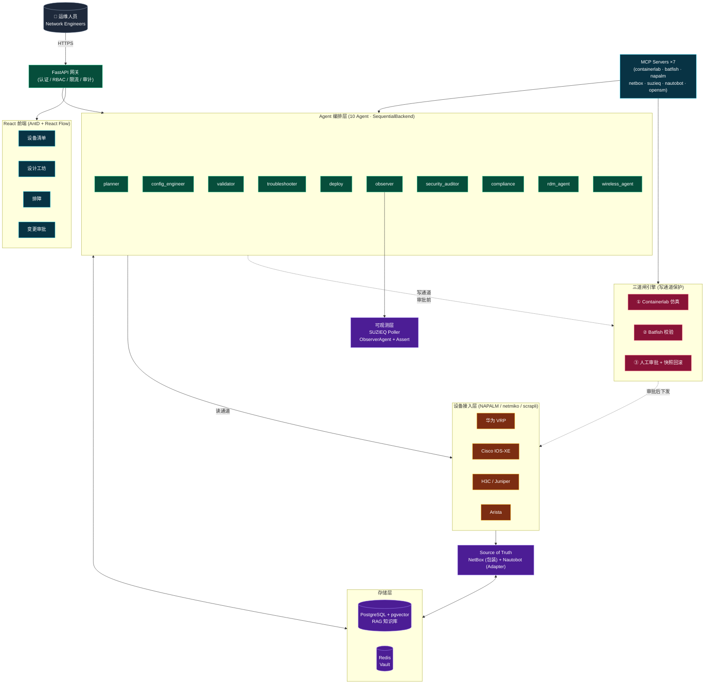

# NetSage · AI 网络工程师智能平台

> **v1.0.0** · AI 辅助网络工程平台：让 AI 承担设计、配置生成、故障排查、安全审计、RDMA 调优等专业工作。
>

[](https://github.com/echocc00/NetSage/releases/latest)
[](./LICENSE)
[](https://github.com/echocc00/NetSage/actions/workflows/license-check.yml)

> 💼 **商业授权 / Commercial licensing**
>
> 本项目以开源协议发布(详见 [LICENSE](./LICENSE)),你可自由用于个人/企业内部项目。
> 若你希望用于**对外商业产品 / SaaS / 销售**并需要:
> - 作者署名可移除 / 不想被认出来源
> - 闭源分发 / 不公开修改
> - 长期维护支持 / 私有定制
> - 法律意见 / 合规背书
>
> 请通过以下方式联系作者协商**独立商业授权**:
> - GitHub: [@echocc00](https://github.com/echocc00)
> - 项目主页 Issues / Discussions(按项目)
>
> 大部分项目 24 小时内响应,首次咨询免费。
>
> *(本说明不构成法律意见,具体权利义务以 [LICENSE](./LICENSE) 文本为准。)*

---

> 基线文档：[最终技术方案 v2.0](doc/NetSage-最终技术方案-v2.0.md) · [开发计划](doc/NetSage-开发计划与详细设计-v1.0.md) · [Phase 2 规划](doc/NetSage-Phase2-规划-v1.0.md) · [Phase 3 规划](doc/NetSage-Phase3-规划-v1.0.md)

## 能力总览（v1.0.0）

| 模块 | 状态 | 说明 |
|---|---|---|
| Agent 编排 | ✅ | 10 Agent：planner / config_engineer / validator / troubleshooter / deploy / observer / security_auditor / compliance / rdm_agent / wireless_agent |
| 三道闸引擎 | ✅ | Containerlab 仿真 → Batfish 校验 → 人工审批 + 快照回滚 |
| 多厂商接入 | ✅ | 华为 VRP / Cisco IOS-XE / H3C / Juniper / Arista（NAPALM + netmiko + scrapli），86 配置模板 |
| SourceOfTruth 双适配器 | ✅ | NetBox（真实 REST）+ Nautobot（Adapter，mock 模式默认）+ 自研 App v0.1 |
| 安全合规 | ✅ | SecurityAuditor + 30 条基线规则（CIS + 厂商加固）+ ACL 分析（Cisco + 华为） |
| 故障排障 | ✅ | RCA 引擎（26 条规则 + 概率排序）+ Troubleshooter Agent |
| 自动化闭环 | ✅ | 诊断→修复→验证→审批→下发→监控，自动化率 83%（生产，仅 approve 人工） |
| 数据脱敏 | ✅ | Layer1/3 四层模型，**已接入 LLM 网关**（黑盒阻断 + 灰盒强制脱敏 + 响应还原） |
| 审计合规 | ✅ | sha256 哈希链 + INSERT ONLY + 五级 RBAC（等保三权分立） |
| 生产化 | ✅ | 运营大屏 + DR/备份（RPO 24h/RTO 2h）+ LLM 缓存 + 生产 Docker + OpenAPI |
| React 前端 | ✅ | 9 页面：大屏 / 设备 / 设计工坊 / 排障 / 审批 / 审计 / RDMA / 无线 / 登录 |
| RDMA 专项 | 🟡 | RdmAgent（PFC/ECN/DCQCN 配置诊断）+ OpenSM 容器化。**默认 mock 模式，真实 IB 硬件未验证** |
| 无线专项 | 🟡 | WirelessAgent（AP 布放 + 信道规划 + 漫游域 + 安全策略）。**WLC API 未接入** |
| 多租户 + SSO | 🟡 | Tenant model + OIDC（PKCE + nonce + state）。**未接真实 Keycloak 验证** |
| RAG 知识库 | 🟡 | 混合检索 + 重排序（pgvector）已实现。**语料仅 3 份华为手册样本，hit_rate 待实测** |
| NetAI-Bench | 🟡 | 513 题 schema 100% 通过。**90% 为程序生成，人工复审进行中** |

> **状态说明**：✅ = 完整实现且测试覆盖 · 🟡 = 代码就绪但依赖外部条件（硬件/语料/第三方服务）未端到端验证

## 快速开始
> 📘 想要 **5 分钟完整跑通**?[看 `docs/getting-started.md`](docs/getting-started.md) — 涵盖 docker / 数据库初始化 / 验证清单。


### 环境要求

- Python 3.11+（开发用 3.12）
- Docker 29+ & Docker Compose
- Node.js 20+（前端）

### 启动开发环境

```bash
# 1. 拷贝环境变量
cp .env.example .env  # 按需填写 LLM/NetBox/JWT 密钥

# 2. 起依赖服务（PG+pgvector / Redis / Vault）
docker compose -f infra/docker-compose.dev.yml up -d

# 3. 后端
cd backend
python -m venv .venv
. .venv/Scripts/activate        # Windows bash
pip install -e ".[dev]"
alembic upgrade head
uvicorn app.main:app --reload

# 4. 前端
cd ../frontend
npm install
npm run dev

# 5. 验收
PYTHONIOENCODING=utf-8 python scripts/phase3_acceptance.py
```

## 仓库结构

```
backend/              FastAPI 后端（Python 3.11+，10 Agent + 三道闸 + 双 SSoT）
mcp-servers/          MCP Server ×7（containerlab / batfish / napalm / netbox / suzieq / nautobot / opensm）
nautobot-app-designs/ 自研 Nautobot App v0.1（NetworkDesign 持久化）
frontend/             React + AntD + React Flow（9 页面）
cli/                  nsc CLI（typer，6 命令）
eval/                 NetAI-Bench 评测集（513 题）
infra/                docker-compose（dev / prod / netbox / suzieq / opensm）+ Vault
scripts/              运维脚本（backup / restore）+ _build_archive（历史构建脚本）
doc/                  技术方案 + 开发计划 + Phase 规划 + DR Runbook
```

## 架构



## 安全边界

- **读通道宽松、写通道严格**：写命令只允许模板引擎渲染 + 审批通过的对象，不允许 LLM 裸发任意命令。
- **变更前自动快照**：每次变更前抓取 running-config，支持一键回滚。
- **全程审计哈希链**：谁/何时/什么命令/结果落 PostgreSQL，不可篡改。
- **数据脱敏**：配置送 LLM 前替换 IP/密码/主机名为占位符。

## 路线图

- ✅ **Phase 1**（M1-M2）：平台骨架 + 核心链路（10/10）
- ✅ **Phase 2**（M3-M4）：多厂商 + 数据闭环 + 排障链路（核心 10/14，验收 12/12）
- ✅ **Phase 3**（M5-M6）：Nautobot 集成 + 安全合规 + 自动化闭环（10/10，验收 12/12）
- ✅ **Phase 4**（M7-M12）：RDMA + 无线 + 多租户 + SSO + 生产化（v1.0.0）

### v1.0.0 已知限制（诚实清单）

| 项 | 现状 | 解锁条件 |
|---|---|---|
| RAG hit_rate | 语料仅 3 份华为手册样本（543 行），hit_rate 未达 85% 目标 | 厂商手册全量 ingest（需版权授权） |
| RDMA 真实验证 | OpenSM/RdmAgent 默认 mock 模式，2 节点硬编码数据 | IB 硬件测试床 + perftest |
| OpenSM 法务 | 工程隔离已做（不链接/不分发/不修改），法务 memo 未出具 | 法务团队签字 |
| Nautobot | Adapter 完整但默认 mock，未部署真实 Nautobot 服务 | 部署 Nautobot v2 |
| OIDC/SSO | PKCE + nonce + state 完整，未接真实 Keycloak 端到端验证 | Keycloak 实例 |
| 评测集质量 | 513 题 schema 100% 通过，但 90% 为程序生成 | 人工复审（进行中，见 `source` 字段） |
| WLC API | WirelessAgent 生成配置，未接厂商 WLC 控制器 API | 厂商 API 凭据 |

## 许可证

Apache-2.0


---

<sub>📋 本 README 遵循 [echocc00/README-TEMPLATE.md](https://github.com/echocc00/.github/blob/main/README-TEMPLATE.md) 写作规范</sub>