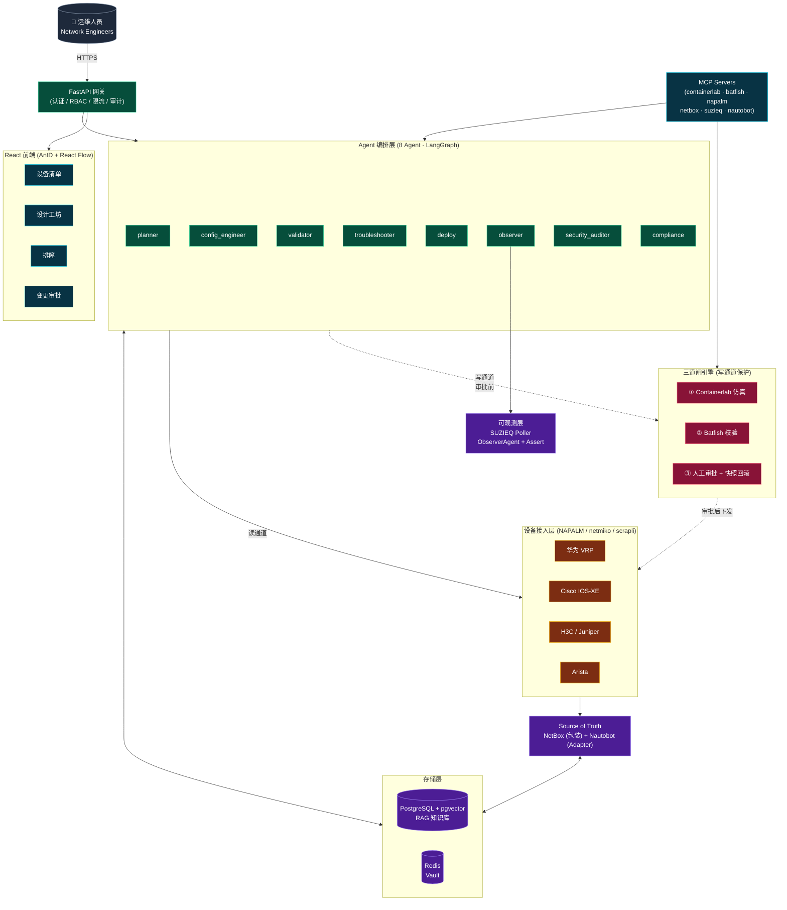

# NetSage · AI 网络工程师智能平台

> **v0.1.1** · AI 辅助网络工程平台：让 AI 承担设计、配置生成、故障排查、安全审计等专业工作。
>

[](https://github.com/echocc00/NetSage/releases/latest)

> 💼 **商业授权 / Commercial licensing**
>
> 本项目以开源协议发布(详见 [LICENSE](./LICENSE)),你可自由用于个人/企业内部项目。
> 若你希望用于**对外商业产品 / SaaS / 销售**并需要:
> - 作者署名可移除 / 不想被认出来源
> - 闭源分发 / 不公开修改
> - 长期维护支持 / 私有定制
> - 法律意见 / 合规背书
>
> 请通过以下方式联系作者协商**独立商业授权**:
> - GitHub: [@echocc00](https://github.com/echocc00)
> - 项目主页 Issues / Discussions(按项目)
>
> 大部分项目 24 小时内响应,首次咨询免费。
>
> *(本说明不构成法律意见,具体权利义务以 [LICENSE](./LICENSE) 文本为准。)*

---

> 基线文档：[最终技术方案 v2.0](doc/NetSage-最终技术方案-v2.0.md) · [开发计划](doc/NetSage-开发计划与详细设计-v1.0.md) · [Phase 2 规划](doc/NetSage-Phase2-规划-v1.0.md) · [Phase 3 规划](doc/NetSage-Phase3-规划-v1.0.md)

## 能力总览（v0.1.1）

| 模块 | 状态 | 说明 |
|---|---|---|
| Agent 编排 | ✅ | 8 Agent：planner / config_engineer / validator / troubleshooter / deploy / observer / security_auditor / compliance |
| 三道闸引擎 | ✅ | Containerlab 仿真 → Batfish 校验 → 人工审批 + 快照回滚 |
| 多厂商接入 | ✅ | 华为 VRP / Cisco IOS-XE / H3C / Juniper / Arista（NAPALM + netmiko + scrapli） |
| SourceOfTruth 双适配器 | ✅ | NetBox（包装）+ Nautobot（Adapter + 自研 App v0.1） |
| 安全合规 | ✅ | SecurityAuditor + 30 条基线规则（CIS + 厂商加固）+ Batfish ACL 分析（Cisco + 华为） |
| 故障排障 | ✅ | RCA 引擎（规则 + 概率 + RAG 关联）+ Troubleshooter Agent |
| 自动化闭环 | ✅ | 诊断→修复→验证→审批→下发→监控，自动化率 100%（演示）/ 83%（生产，仅 approve 人工） |
| SUZIEQ 可观测 | ✅ | Poller + ObserverAgent + Assert 框架 |
| RAG 知识库 | ✅ | 混合检索 + 重排序（pgvector） |
| 数据脱敏 | ✅ | Layer1/3 四层模型 + 审计哈希链 |
| React 前端 | ✅ | 设备 / 设计工坊（React Flow）/ 排障 / 变更审批 / 配置审计 |
| RBAC | ✅ | 五级（viewer/operator/engineer/admin/auditor，等保三权分立） |

## 快速开始

### 环境要求

- Python 3.11+（开发用 3.12）
- Docker 29+ & Docker Compose
- Node.js 20+（前端）

### 启动开发环境

```bash
# 1. 拷贝环境变量
cp .env.example .env  # 按需填写 LLM/NetBox/JWT 密钥

# 2. 起依赖服务（PG+pgvector / Redis / Vault）
docker compose -f infra/docker-compose.dev.yml up -d

# 3. 后端
cd backend
python -m venv .venv
. .venv/Scripts/activate        # Windows bash
pip install -e ".[dev]"
alembic upgrade head
uvicorn app.main:app --reload

# 4. 前端
cd ../frontend
npm install
npm run dev

# 5. 验收
PYTHONIOENCODING=utf-8 python scripts/phase3_acceptance.py
```

## 仓库结构

```
backend/              FastAPI 后端（Python 3.11+，8 Agent + 三道闸 + 双 SSoT）
mcp-servers/          MCP Server（containerlab / batfish / napalm / netbox / suzieq / nautobot）
nautobot-app-designs/ 自研 Nautobot App v0.1（NetworkDesign 持久化）
frontend/             React + AntD + React Flow
cli/                  nsc CLI（typer）
eval/                 NetAI-Bench 评测集
infra/                docker-compose / Vault / NetBox / SUZIEQ
doc/                  技术方案 + 开发计划 + Phase 规划
```

## 架构



## 安全边界

- **读通道宽松、写通道严格**：写命令只允许模板引擎渲染 + 审批通过的对象，不允许 LLM 裸发任意命令。
- **变更前自动快照**：每次变更前抓取 running-config，支持一键回滚。
- **全程审计哈希链**：谁/何时/什么命令/结果落 PostgreSQL，不可篡改。
- **数据脱敏**：配置送 LLM 前替换 IP/密码/主机名为占位符。

## 路线图

- ✅ **Phase 1**（M1-M2）：平台骨架 + 核心链路（10/10）
- ✅ **Phase 2**（M3-M4）：多厂商 + 数据闭环 + 排障链路（核心 10/14，验收 12/12）
- ✅ **Phase 3**（M5-M6）：Nautobot 集成 + 安全合规 + 自动化闭环（10/10，验收 12/12）
- ⏳ **Phase 4**（M7-M12）：RDMA/IB + 无线 + 多租户 + SSO + 生产化

### v0.1.0 遗留 TODO

- P2-5：多厂商模板库扩展至 ~80（当前 2 个骨架）
- P2-11：排障闭环 3 场景评测题
- P2-13：RAG 500 题 + hit_rate ≥85%（需厂商手册语料）

## 许可证

Apache-2.0
